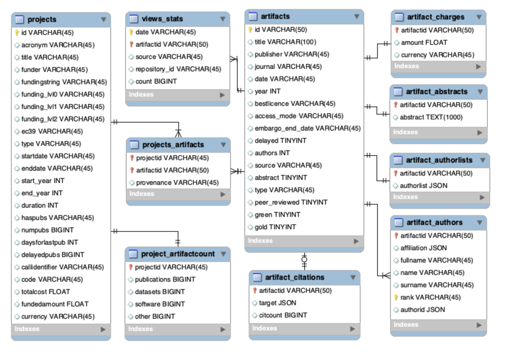

# UDFBench

Welcome to the **UDFBench** repository! 

UDFBench is a UDF-centric database benchmark that focuses on UDFs and their implications to SQL query performance. The benchmark is based on a real-world schema and data, and comprises 21 queries involving 42 scalar, aggregate and table User-Defined Functions (UDFs). 

This repository provides an initial deployment of UDFBench on five data engines: MonetDB, PostgreSQL, DuckDB, SQLite, and Spark. And it also provides instructions on how it can be deployed on new systems. 


### Citing UDFBench

If you use UDFBench, please cite the relevant publication:

```
@article{udfbench,
  title        = {The UDFBench Benchmark for General-purpose UDF Queries},
  author       = {Yannis Foufoulas and Theoni Palaiologou and Alkis Simitsis},
  journal      = {Proc. {VLDB} Endow.},
  volume       = {18},
  year         = {2025}
}
```

---

##  How to Use  

For installation and execution instructions, please refer to the **[instructions.md](instructions.md)** file in the repository.  

---


## Schema and Data  

### Schema ###

The UDFBench schema hails from a real-world application that performs information extraction, text mining and analytics over
Open Access publications, and is a curated subset of the **[OpenAIRE Graph Dataset](https://zenodo.org/records/10488385)**.

The UDFBench schema comprises 2 core tables: `artifacts` and `projects`. These connect to 7 tables containing author metadata, author lists per artifact (in JSON), artifact abstracts and accessing fees, artifacts related to a project, and to 1 table with view statistics for each artifact.

The schema includes fields of various data types and sizes, and allows building queries with expensive relational operators such as aggregation, grouping, and join paths of moderate length (up to 5).

Note that the UDFBench schema contains denormalized features such as nested attributes (JSON list, dict) and the UDFBench queries connect to external denormalized files, hence, enabling testing complex UDF functionality beyond relational. The external files contain information from sources such as arxiv, crossred, pubmed, etc. and are in various formats such as csv, txt, xml, json, etc.

The ER-diagram of the UDFBench schema is as follows:



### Dataset ###

UDFBench contains four dataset sizes: `tiny`, `small`, `medium`, and `large`.  

The `tiny` dataset is intended for deployment testing and it is included in this repository in the `dataset` directory. 

The other three sizes are hosted in **[Zenodo](https://zenodo.org/records/14260428)** and can be automatically deployed into the UDFBench schema using automated scripts (see **[instructions.md](instructions.md)**).

Each dataset consists of **10 CSV files** corresponding to the 10 UDFBench schema tables. 

The external files used in the UDFBench queries are also available in the same Zenodo repository.  

---

## Queries 

<!--
## Queries and UDFs 

The queries and UDFs are implemented for all supported engines and can be found in the `queries` and `udfs` directories, respectively, under each engine directory. The UDFs are further organized by their type into the `udfs` directory.  
-->

<!--
  - **MonetDB**  
  - **PostgreSQL**  
  - **DuckDB**  
  - **SQLite**
  - **PySpark**
-->

<!--
### Queries ###
-->

UDFBench comprises 21 SQL queries with UDFs organized in four query classes:

- (QC1) Queries with UDFs and a few relational operators (emphasis on UDFs). These queries are useful for evaluating UDF related overheads.
- (QC2) Queries with a blend of UDFs and expensive relational operators (e.g., join, group) or nesting. These queries are useful for evaluating the interaction of UDFs with heavy relational operators.
- (QC3) Queries with UDFs and complex relational logic. These queries are usefule for evaluating the impact of UDFs in query execution/optimization.
- (QC4) Queries with UDF and DML operations (e.g., insert, update).

The queries are implemented for all supported engines and can be found in the `queries` directory under each `engine` directory. 

### Query List  

**Query Class 1 (QC1)**

<details>
<summary>Q1 - Date Extraction with Scalar UDFs</summary>
<p>
  
- **Description**: Extract the year, month, and day from a date using three scalar UDFs.  
- **Input**: 1 string.  
- **Output**: 3 integer values.  
</p>
</details>

<details>
<summary>Q2 - Date Extraction with Table UDF</summary>
<p>
  
- **Description**: Extract the year, month, and day from a date using a single table-returning UDF.  
- **Input**: 1 string column.  
- **Output**: 3 integer columns.  
</p>
</details>

</p>
</details>

<details>
<summary>Q3 - Multi-language Scalar UDFs</summary>
<p>
 
- **Description**: Extract the year, month, and day from a date using scalar UDFs implemented in different languages.  
- **Input**: 1 string.  
- **Output**: 3 integer values.  
</p>
</details>

<details>
<summary>Q4 - Average and Median with Aggregate UDFs</summary>
<p>
 
- **Description**: Compute the average and median author count per artifact using two aggregate UDFs.  
- **Input**: 1 integer.  
- **Output**: 2 float values.  
</p>
</details>

<details>
<summary>Q5 - Aggregate Calculations with Table UDF</summary>
<p>
 
- **Description**: Compute the average and median author count per artifact using a single table-returning UDF.  
- **Input**: 1 integer.  
- **Output**: 2 float values.  
</p>
</details>

<details>
<summary>Q6 - File Format Conversion</summary>
<p>
 
- **Description**: Convert and union two disk files (XML and JSON formats) into a single CSV file.  
- **Input**: 2 file paths.  
- **Output**: 1 CSV file.  
</p>
</details>

<details>
<summary>Q7 - JSON File Analysis</summary>
<p>
 
- **Description**: Analyze a JSON file with publication metadata to compute the average citation and author counts.  
- **Input**: 1 file path.  
- **Output**: 2 float values.  
</p>
</details>

<details>
<summary>Q8 - Publication Metadata Analysis</summary>
<p>
 
- **Description**: Analyze publication metadata from two tables (author lists and citations) to compute the average citation and author counts.  
- **Input**: 2 tables.  
- **Output**: 2 float values.  
</p>
</details>

<details>
<summary>Q9 - Author Pair Counting</summary>
<p>

- **Description**: Clean author list data and count all possible author pairs for publications with fewer than 50 authors.  
- **Input**: 1 table.  
- **Output**: 1 integer value.  
</p>
</details>

**Query Class 2 (QC2)**

<details>
<summary>Q10 - Iterative k-Means Clustering</summary>
<p>
 
- **Description**: Perform iterative k-means clustering on publications grouped by type, based on funding amounts accessed through funding projects.  
- **Input**: 2 tables.  
- **Output**: 3 values (1 string, 1 integer, 1 float).  
</p>
</details>

<details>
<summary>Q11 - Recursive k-Means Clustering</summary>
<p>
 
- **Description**: Perform recursive k-means clustering on publications grouped by type, based on funding amounts accessed through funding projects.  
- **Input**: 2 tables.  
- **Output**: 3 values (1 string, 1 integer, 1 float).  
</p>
</details>

<details>
<summary>Q12 - Noisy Artifact Rankings</summary>
<p>
 
- **Description**: Return the 10 most-viewed artifacts from the past year, adding Gaussian noise to the counts.  
- **Input**: 1 table.  
- **Output**: 1 string, 1 float.  
</p>
</details>

<details>
<summary>Q13 - JSON Link Extraction</summary>
<p>
 
- **Description**: Extract links between publications and projects from an external JSON file.  
- **Input**: 1 file.  
- **Output**: 2 string values.  
</p>
</details>

**Query Class 3 (QC3)**

<details>
<summary>Q14 - Recent Author Affiliations</summary>
<p>
 
- **Description**: Return the most recent affiliation of the first author for publications funded by the European Commission.  
- **Input**: 4 tables.  
- **Output**: 2 string values.  
</p>
</details>

<details>
<summary>Q15 - XML Link Extraction</summary>
<p>
 
- **Description**: Extract links between publications and projects from an external XML file, excluding links that already exist in the database.  
- **Input**: 1 file.  
- **Output**: 2 string values.  
</p>
</details>

<details>
<summary>Q16 - Author Collaboration Analysis</summary>
<p>
 
- **Description**: Analyze author collaborations within projects by computing:  
  - Author pairs collaborating during the project.  
  - Author pairs collaborating before the project.  
  - Author pairs collaborating after the project.  
- **Input**: 4 tables.  
- **Output**: 3 string columns and 3 integer columns.  
</p>
</details>

<details>
<summary>Q17 - TF/IDF Computation</summary>
<p>
 
- **Description**: Compute the term frequency-inverse document frequency (TF/IDF) for each term in artifact abstracts.  
- **Input**: 1 table.  
- **Output**: 2 string values.  
</p>
</details>

<details>
<summary>Q18 - Jaccard Similarity</summary>
<p>

- **Description**: Compute Jaccard similarity between document abstracts from two external files and return the top 5 similar documents per source document.  
- **Input**: 2 files.  
- **Output**: 2 strings, 1 float.  
</p>
</details>

<details>
<summary>Q19 - Project Artifact Linking</summary>
<p>
 
- **Description**: Return the pivoted count of links to artifacts of different types for each project.  
- **Input**: 2 tables.  
- **Output**: 1 string, 4 integers.  
</p>
</details>


**Query Class 4 (QC4)**

<details>
<summary>Q20 - Date Cleaning and Updating</summary>
<p>
 
- **Description**: Update artifact table dates after cleaning.  
- **Input**: 1 table.  
- **Output**: Updated table.  
</p>
</details>

<details>
<summary>Q21 - JSON Link Insertion</summary>
<p>
  
- **Description**: Extract links between publications and projects from a JSON file and insert them into the `projects_artifacts` table.  
- **Input**: 1 file.  
- **Output**: Updated table.  
</p>
</details>

---

## UDFs  

UDFBench comprises 42 UDFs, categorized as follows:  

- **24 Scalar UDFs**  
- **4 Aggregate UDFs**  
- **14 Table UDFs**, covering various subtypes (see the UDFBench paper for details)  

The UDFs are implemented for all supported engines and can be found in the `udfs` directory under each `engine` directory, organized by their types.  


### UDF List

<details>
<summary>Scalar UDFs</summary>
<p>

| ID   | Name            | Description                                                                                                                                  | Type  | #Inputs | Input Type | #Outputs | Output Type | Pipeline | Blocking | Parallelizable | Side Effect | State | Cost       |
|------|-----------------|----------------------------------------------------------------------------------------------------------------------------------------------|-------|---------|------------|----------|-------------|----------|----------|----------------|-------------|-------|------------|
| U1   | Addnoise        | Adds Gaussian noise to a value and returns a float                                                                                         | S-1   | 1       | numeric    | 1        | float       | x        |          | x              |             |       | O(n)       |
| U2   | Clean           | Performs a data cleaning task on the string tokens of a JSON list                                                                          | S-1   | 1       | string     | 1        | string      | x        |          | x              |             | x     | O(n)       |
| U3   | Cleandate       | Reads a date and converts it to a common format (if needed) and handles problem dates                                                      | S-1   | 1       | string     | 1        | string      | x        |          | x              |             | x     | O(n)       |
| U4   | Converttoeuro   | Converts currency to euro, returns a float                                                                                                | S-1   | 1       | numeric    | 1        | float       | x        |          | x              |             |       | O(n)       |
| U5   | Extractclass    | Extracts class from a string with format `funder::class::projectid`                                                                         | S-1   | 1       | string     | 1        | string      | x        |          | x              |             |       | O(n)       |
| U6   | Extractcode     | Extracts project ID from a structured string containing the funder's ID, funding class, and project ID                                     | S-1   | 1       | string     | 1        | string      | x        |          | x              |             | x     | O(n)       |
| U7   | Extractday      | Reads a date (as a string) and extracts an integer with the day                                                                            | S-1   | 1       | string     | 1        | int         | x        |          | x              |             | x     | O(n)       |
| U8   | Extractfunder   | Extracts funder from a string with format `funder::class::projectid`                                                                        | S-1   | 1       | string     | 1        | string      | x        |          | x              |             |       | O(n)       |
| U9   | Extractid       | Extracts project ID from a string with format `funder::class::projectid`                                                                   | S-1   | 1       | string     | 1        | string      | x        |          | x              |             |       | O(n)       |
| U10  | Extractmonth    | Reads a date (as a string) and extracts an integer with the month                                                                          | S-1   | 1       | string     | 1        | int         | x        |          | x              |             | x     | O(n)       |
| U11  | Extractprojectid | Processes a text snippet and extracts a 6-digit project identifier                                                                        | S-1   | 1       | string     | 1        | string      | x        |          | x              |             | x     | O(n)       |
| U12  | Extractyear     | Reads a date (as a string) and extracts an integer with the year                                                                           | S-1   | 1       | string     | 1        | int         | x        |          | x              |             | x     | O(n)       |
| U13  | Filterstopwords | Removes stopwords from the input text                                                                                                      | S-1   | 1       | string     | 1        | string      | x        |          | x              |             | x     | O(n)       |
| U14  | Frequentterms   | Returns a space-separated text containing the most N% frequent tokens                                                                      | S-1   | 1       | string     | 1        | string      | x        |          | x              |             |       | O(n)       |
| U15  | Jaccard         | Processes two JSON lists with tokens and calculates the Jaccard distance                                                                   | S-1   | 2       | json       | 1        | float       | x        |          | x              |             |       | O(n*k)     |
| U16  | Jpack           | Converts a string to a JSON list with tokens                                                                                              | S-1   | P       | P          | 1        | json        | x        |          | x              |             |       | O(n*k)     |
| U17  | Jsoncount       | Returns the length of a JSON list                                                                                                         | S-1   | 1       | json       | 1        | int         | x        |          | x              |             |       | O(n)       |
| U18  | Jsort           | Processes a JSON list and returns a sorted JSON list                                                                                      | S-1   | 1       | string     | 1        | string      | x        |          | x              |             |       | O(n)       |
| U19  | Jsortvalues     | Processes a JSON list, if a value contains more than one token it sorts the value tokens                                                  | S-1   | 1       | string     | 1        | string      | x        |          | x              |             |       | O(n)       |
| U20  | Keywords        | Removes punctuation from text and returns the keywords in one string                                                                     | S-1   | 1       | string     | 1        | string      | x        |          | x              |             | x     | O(n)       |
| U21  | Log10           | Computes and returns the logarithm                                                                                                        | S-1   | 1       | numeric    | 1        | float       | x        |          | x              |             |       | O(n)       |
| U22  | Lower           | Converts the input text to lowercase                                                                                                      | S-1   | 1       | string     | 1        | string      | x        |          | x              |             |       | O(n)       |
| U23  | Removeshortterms | Processes a JSON list, if a value contains more than one token it removes tokens with length less than 3 chars                           | S-1   | 1       | string     | 1        | string      | x        |          | x              |             |       | O(n)       |
| U24  | Stem            | Stems the input text                                                                                                                     | S-1   | 1       | string     | 1        | string      | x        |          | x              |             | x     | O(n)       |

</p>
</details>


<details>
<summary>Aggregate UDF</summary>
<p>

| ID   | Name            | Description                                                                                                                                  | Type  | #Inputs | Input Type | #Outputs | Output Type | Pipeline | Blocking | Parallelizable | Side Effect | State | Cost       |
|------|-----------------|----------------------------------------------------------------------------------------------------------------------------------------------|-------|---------|------------|----------|-------------|----------|----------|----------------|-------------|-------|------------|
| U25  | Avg             | Computes average                                                                                                                         | A-2   | 1       | numeric    | 1        | float       | x        |          | x              |             |       | O(n)       |
| U26  | Count           | Computes count                                                                                                                           | A-2   | 1       | P          | 1        | int         | x        |          | x              |             |       | O(n)       |
| U27  | Max             | Computes max                                                                                                                             | A-2   | 1       | P          | 1        | int         | x        |          | x              |             | x     | O(n)       |
| U28  | Median          | Computes median                                                                                                                          | A-2   | 1       | numeric    | 1        | numeric     |          | x        |                |             |       | O(nlogn)   |

</p>
</details>

<details>
<summary>Table UDFs</summary>
<p>

| ID   | Name            | Description                                                                                                                                  | Type  | #Inputs | Input Type | #Outputs | Output Type | Pipeline | Blocking | Parallelizable | Side Effect | State | Cost       |
|------|-----------------|----------------------------------------------------------------------------------------------------------------------------------------------|-------|---------|------------|----------|-------------|----------|----------|----------------|-------------|-------|------------|
| U29  | Extractfromdate | Reads a date (as string), returns 3 column values (day, month, year)                                                       | T-3   | 1       | string     | 3        | rset        | x        |          | x              |             | x     | O(n)       |
| U30  | Jsonparse       | Parses a JSON dict per time and returns a tuple with the values                                                             | T-3   | 1       | json       | P        | P           | x        |          | x              |             |       | O(n*k)     |
| U31  | Combinations    | Reads a JSON list and returns a table with all the combinations per an integer parameter                                   | T-4   | 1       | json       | P        | P           | x        |          | x              |             |       | O(n*k^2)   |
| U32  | Extractkeys     | Selects keys from XML parsed input                                                                                          | T-2   | 1       | xml        | P        | P        | x        |          | x              |             | x      | O(n)       |
| U33  | Strsplitv       | Processes a string at a time and returns its tokens in separate rows                                                       | T-4   | 1       | string     | 1        | string      | x        |          | x              |             |       |           | O(n*k)     |
| U34  | Jgroupordered   | Performs a group by with an aggregate defined as a (named) parameter on a subquery ordered by an attribute                 | T-5   | P       | P          | P        | P       | x        |          |               |             |       | O(n)       |
| U35  | Kmeans          | Iterative version of the kmeans function                                                                                   | T-5   | P       | numeric    | P        | P           |         | x        |                |             |       | O(n^2)     |
| U36  | Kmeans          | Clusters input data using recursive kmeans, returns cluster id and data point                                               | T-5   | P       | numeric    | P        | P           |         | x        |                |            | x       | O(n^2)     |
| U37  | Xmlparse        | Parses XML input and returns a table                                                                                       | T-5   | 1       | xml        | P        | P           |          | x        |                |             |       | O(n)       |
| U38  | Pivot           | Converts rows of a specific attribute (optionally grouped by another attribute) into columns, while applying an aggregation within the transformed dataset, and returns one tuple per input group | T-6   | P       | P          | P        | P        |          | x         |                |             |       | O(n*k)     |
| U39  | Top             | Processes one group at a time and returns the top N values of an attribute                                                | T-7   | P       | P          | P        | P        | x        |          | x              |             |       | O(n*logk)  |
| U40  | File            | Parses an external file (CSV, XML, JSON) and returns a table                                                                | T-8   | 1       | string     | P        | P           | x        |          |                |              |       |  O(n)       |
| U41  | Output          | Exports the results of a subquery to local storage in various formats and returns true if it succeeds                      | T-9   | P       | P          | 1        | bool        | x        |          |               | x            |       | O(n)       |
| U42  | getstats        | Inputs a table with integer values and returns the avg and the median for each input column                               | T-10  | P       | numeric    | P        | float       |         | x        |                |             |       | O(n*logn)  |

</p>
</details>


<!--
---

## Detailed info for queries and UDFs

| ID   | Name            | Description                                                                                                                                  | Type  | #Inputs | Input Type | #Outputs | Output Type | Pipeline | Blocking | Parallelizable | Side Effect | State | Cost       |
|------|-----------------|----------------------------------------------------------------------------------------------------------------------------------------------|-------|---------|------------|----------|-------------|----------|----------|----------------|-------------|-------|------------|
| **Scalar UDF**                                                                                                                |
| U1   | Addnoise        | Adds Gaussian noise to a value and returns a float                                                                                         | S-1   | 1       | numeric    | 1        | float       | x        |          | x              |             |       | O(n)       |
| U2   | Clean           | Performs a data cleaning task on the string tokens of a JSON list                                                                          | S-1   | 1       | string     | 1        | string      | x        |          | x              |             | x     | O(n)       |
| U3   | Cleandate       | Reads a date and converts it to a common format (if needed) and handles problem dates                                                      | S-1   | 1       | string     | 1        | string      | x        |          | x              |             | x     | O(n)       |
| U4   | Converttoeuro   | Converts currency to euro, returns a float                                                                                                | S-1   | 1       | numeric    | 1        | float       | x        |          | x              |             |       | O(n)       |
| U5   | Extractclass    | Extracts class from a string with format `funder::class::projectid`                                                                         | S-1   | 1       | string     | 1        | string      | x        |          | x              |             |       | O(n)       |
| U6   | Extractcode     | Extracts project ID from a structured string containing the funder's ID, funding class, and project ID                                     | S-1   | 1       | string     | 1        | string      | x        |          | x              |             | x     | O(n)       |
| U7   | Extractday      | Reads a date (as a string) and extracts an integer with the day                                                                            | S-1   | 1       | string     | 1        | int         | x        |          | x              |             | x     | O(n)       |
| U8   | Extractfunder   | Extracts funder from a string with format `funder::class::projectid`                                                                        | S-1   | 1       | string     | 1        | string      | x        |          | x              |             |       | O(n)       |
| U9   | Extractid       | Extracts project ID from a string with format `funder::class::projectid`                                                                   | S-1   | 1       | string     | 1        | string      | x        |          | x              |             |       | O(n)       |
| U10  | Extractmonth    | Reads a date (as a string) and extracts an integer with the month                                                                          | S-1   | 1       | string     | 1        | int         | x        |          | x              |             | x     | O(n)       |
| U11  | Extractprojectid | Processes a text snippet and extracts a 6-digit project identifier                                                                        | S-1   | 1       | string     | 1        | string      | x        |          | x              |             | x     | O(n)       |
| U12  | Extractyear     | Reads a date (as a string) and extracts an integer with the year                                                                           | S-1   | 1       | string     | 1        | int         | x        |          | x              |             | x     | O(n)       |
| U13  | Filterstopwords | Removes stopwords from the input text                                                                                                      | S-1   | 1       | string     | 1        | string      | x        |          | x              |             | x     | O(n)       |
| U14  | Frequentterms   | Returns a space-separated text containing the most N% frequent tokens                                                                      | S-1   | 1       | string     | 1        | string      | x        |          | x              |             |       | O(n)       |
| U15  | Jaccard         | Processes two JSON lists with tokens and calculates the Jaccard distance                                                                   | S-1   | 2       | json       | 1        | float       | x        |          | x              |             |       | O(n*k)     |
| U16  | Jpack           | Converts a string to a JSON list with tokens                                                                                              | S-1   | P       | P          | 1        | json        | x        |          | x              |             |       | O(n*k)     |
| U17  | Jsoncount       | Returns the length of a JSON list                                                                                                         | S-1   | 1       | json       | 1        | int         | x        |          | x              |             |       | O(n)       |
| U18  | Jsort           | Processes a JSON list and returns a sorted JSON list                                                                                      | S-1   | 1       | string     | 1        | string      | x        |          | x              |             |       | O(n)       |
| U19  | Jsortvalues     | Processes a JSON list, if a value contains more than one token it sorts the value tokens                                                  | S-1   | 1       | string     | 1        | string      | x        |          | x              |             |       | O(n)       |
| U20  | Keywords        | Removes punctuation from text and returns the keywords in one string                                                                     | S-1   | 1       | string     | 1        | string      | x        |          | x              |             | x     | O(n)       |
| U21  | Log10           | Computes and returns the logarithm                                                                                                        | S-1   | 1       | numeric    | 1        | float       | x        |          | x              |             |       | O(n)       |
| U22  | Lower           | Converts the input text to lowercase                                                                                                      | S-1   | 1       | string     | 1        | string      | x        |          | x              |             |       | O(n)       |
| U23  | Removeshortterms | Processes a JSON list, if a value contains more than one token it removes tokens with length less than 3 chars                           | S-1   | 1       | string     | 1        | string      | x        |          | x              |             |       | O(n)       |
| U24  | Stem            | Stems the input text                                                                                                                     | S-1   | 1       | string     | 1        | string      | x        |          | x              |             | x     | O(n)       |
| **Aggregate UDF**                                                                                                              |
| U25  | Avg             | Computes average                                                                                                                         | A-2   | 1       | numeric    | 1        | float       | x        |          | x              |             |       | O(n)       |
| U26  | Count           | Computes count                                                                                                                           | A-2   | 1       | P          | 1        | int         | x        |          | x              |             |       | O(n)       |
| U27  | Max             | Computes max                                                                                                                             | A-2   | 1       | P          | 1        | int         | x        |          | x              |             | x     | O(n)       |
| U28  | Median          | Computes median                                                                                                                          | A-2   | 1       | numeric    | 1        | numeric     |          | x        |                |             |       | O(nlogn)   |
| **Table UDF**                                                                                                                 |
| U29  | Extractfromdate | Reads a date (as string), returns 3 column values (day, month, year)                                                       | T-3   | 1       | string     | 3        | rset        | x        |          | x              |             | x     | O(n)       |
| U30  | Jsonparse       | Parses a JSON dict per time and returns a tuple with the values                                                             | T-3   | 1       | json       | P        | P           | x        |          | x              |             |       | O(n*k)     |
| U31  | Combinations    | Reads a JSON list and returns a table with all the combinations per an integer parameter                                   | T-4   | 1       | json       | P        | P           | x        |          | x              |             |       | O(n*k^2)   |
| U32  | Extractkeys     | Selects keys from XML parsed input                                                                                          | T-2   | 1       | xml        | P        | P        | x        |          | x              |             | x      | O(n)       |
| U33  | Strsplitv       | Processes a string at a time and returns its tokens in separate rows                                                       | T-4   | 1       | string     | 1        | string      | x        |          | x              |             |       |           | O(n*k)     |
| U34  | Jgroupordered   | Performs a group by with an aggregate defined as a (named) parameter on a subquery ordered by an attribute                 | T-5   | P       | P          | P        | P       | x        |          |               |             |       | O(n)       |
| U35  | Kmeans          | Iterative version of the kmeans function                                                                                   | T-5   | P       | numeric    | P        | P           |         | x        |                |             |       | O(n^2)     |
| U36  | Kmeans          | Clusters input data using recursive kmeans, returns cluster id and data point                                               | T-5   | P       | numeric    | P        | P           |         | x        |                |            | x       | O(n^2)     |
| U37  | Xmlparse        | Parses XML input and returns a table                                                                                       | T-5   | 1       | xml        | P        | P           |          | x        |                |             |       | O(n)       |
| U38  | Pivot           | Converts rows of a specific attribute (optionally grouped by another attribute) into columns, while applying an aggregation within the transformed dataset, and returns one tuple per input group | T-6   | P       | P          | P        | P        |          | x         |                |             |       | O(n*k)     |
| U39  | Top             | Processes one group at a time and returns the top N values of an attribute                                                | T-7   | P       | P          | P        | P        | x        |          | x              |             |       | O(n*logk)  |
| U40  | File            | Parses an external file (CSV, XML, JSON) and returns a table                                                                | T-8   | 1       | string     | P        | P           | x        |          |                |              |       |  O(n)       |
| U41  | Output          | Exports the results of a subquery to local storage in various formats and returns true if it succeeds                      | T-9   | P       | P          | 1        | bool        | x        |          |               | x            |       | O(n)       |
| U42  | getstats        | Inputs a table with integer values and returns the avg and the median for each input column                               | T-10  | P       | numeric    | P        | float       |         | x        |                |             |       | O(n*logn)  |

-->


---

## UDFBench Experimental Suite

UDFBench is a flexible framework for conducting experiments across different database engines. It evaluates the supported **queries** and **UDFs**, and allows the configuration of the following settings:

1. **Dataset Size**: Choose between `small`, `medium`, or `large` datasets to match your benchmarking requirements.  
2. **Parallelism**: Control the number of threads to run.  
3. **Cache State**: Select between `cold` (fresh start) or `hot` cache scenarios.  
4. **Storage Medium**: Test performance on different storage meduims: `hdd`, `ssd`, and `memory`. 
5. **Resource Utilization Monitoring**:  
   - Use **[collectl](https://collectl.sourceforge.net/)** to monitor system resource usage (CPU, memory, disk, etc.).  
   - Store the results for post-experiment analysis.  

More details on how to orchestrate and run an experiment can be found in the **[instructions.md](instructions.md)** file.

<!--
## What Experiments Does UDFBench Offer?  

UDFBench provides a flexible framework for running experiments on various database engines. Users can perform comprehensive evaluations using the available **queries** and **UDFs** in their respective directories, with the ability to configure the following settings:  

The experimental results are stored in the RESULTSPATH (udfbench/results) and is defined at **[utilities/config.sh](utilities/config.sh)**.

These customizable settings enable users to tailor experiments to specific performance scenarios, providing valuable insights into UDF and query performance.  

**Note**: If this experiment suite is run on different or newer software versions, some results may vary, and certain features might not be supported.
-->


### UDFBench Paper Experiments

For the experiments presented in the UDFBench paper, we used the following software versions: 
MonetDB 5 server(v11.50.0), PostgreSQL (17), DuckDB (1.0.0), SQLite3 (3.37.2), Spark/PySpark (3.5.5), Python (3.10.12), gcc (11.4.0), PyPy (7.3.12),
CFFI (1.15.1), APSW (3.40.0.0), NumPy (1.26.4), Pandas (2.2.0),
PyArrow(18.0.0), Scikit-learn (1.4.0), NLTK (3.8.1), Radon 6.0.1. 


**Note**: If these experiments run on different software versions the results may vary and certain features may not be supported.

---
## Disclaimer

This software is provided "as is" without any warranties, express or implied.

---

Thank you for exploring the UDFBench!   
